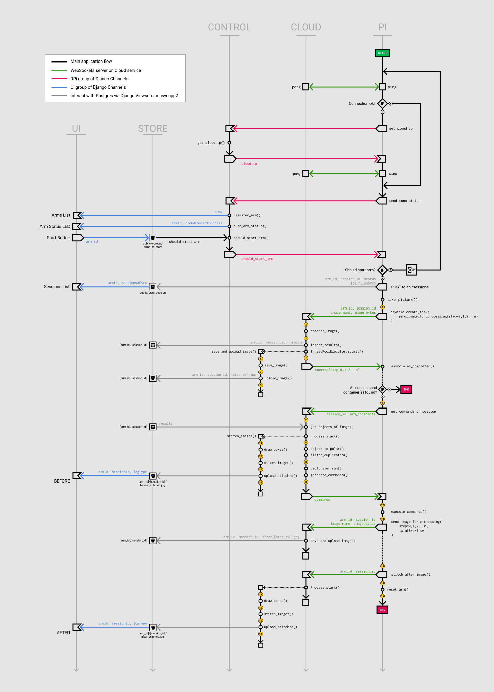

# SorterBot Installer

Medium articles about the project:[Part 1](https://medium.com/swlh/web-application-to-control-a-swarm-of-raspberry-pis-with-an-ai-enabled-inference-engine-b3cb4b4c9fd), [Part 2](https://medium.com/@simon.szalai/web-application-to-control-a-swarm-of-raspberry-pis-with-an-ai-enabled-inference-engine-part-2-73804121c98a), [Part 3](https://medium.com/@simon.szalai/web-application-to-control-a-swarm-of-raspberry-pis-with-an-ai-enabled-inference-engine-part-3-77836f9fc4c2)

This is the root repository for the SorterBot project, where you can find instructions to set up a development environment, as well as directions to deploy the solution to AWS. The project consists of the following repositories:

- **SorterBot Installer**: Current repository, automates setup for development and deployment to AWS.
- **[SorterBot Cloud](https://github.com/simonszalai/sorterbot_cloud)**: Handles compute heavy tasks, it can be deployed to an AWS ECS cluster.
- **[SorterBot Control](https://github.com/simonszalai/sorterbot_control)**: A Django app, which serves as a central control panel, it communicates with the Raspberry Pis, SorterBot Cloud, and the PostgreSQL database.
- **[SorterBot Raspberry](https://github.com/simonszalai/sorterbot_raspberry)**: Python script to be executed on the Raspberry Pis to record data and execute commands.
- **[SorterBot LabelTool](https://github.com/simonszalai/sorterbot_labeltool)**: Labeling tools written in Python to speed up training dataset creation.

## Architecture
The diagram below illustrates how different parts of the solution communicate with each other:


*<p align="center">Figure 1: Communication Diagram of the SorterBot solution ([Full Diagram](https://www.figma.com/file/mOvLbEX2hGPtj6XftA14UP/SorterBot-Messaging?node-id=0%3A1))</p>*

## Development
There are two options to set up a development environment: *local* and *aws-dev*. 

### Local
In *local* mode, the solution can be run without any AWS resources. Even without Internet, as long as the Raspberry Pis are connected to the same local network. To set up the development environment, follow the steps below:

1. Install [Git LFS](https://git-lfs.github.com/) in case you don't have it installed.
1. Clone the SorterBot Installer, Cloud and Control repositories:
    ```
    git clone git@github.com:simonszalai/sorterbot_installer.git
    git clone git@github.com:simonszalai/sorterbot_cloud.git
    git clone git@github.com:simonszalai/sorterbot_control.git
    ```
1. You will need a PostgreSQL database. You can connect to any database, either one deployed to a cloud provider or on localhost. To start a PostgreSQL instance as a Docker image on your local computer, follow these steps:
    1. Download and run a PostgreSQL image from Docker Hub. In the command below, change [ANY_NAME] to a name of your choice, and [SECRET_PASSWORD] to a password, that later you will use as part of the connection string.
        ```
        docker run --name [ANY_NAME] -e POSTGRES_PASSWORD=[SECRET_PASSWORD] -d postgres:11
        ```
   1. After your postgres instance started, run `docker ps`, and copy the CONTAINER ID of the Docker container that runs your database.
   1. Run `docker inspect [CONTAINER ID]`, and in the output, find `NetworkSettings.Networks.bridge.IPAddress`. This will be the host in your connection string. The password will be what you specified above, the port is the default, `5432`, and the username and dbname are both `postgres`. Based on these information, you will be able to construct the connection string in the next step.
1. Follow the instructions under *Run SorterBot Control locally* in the [SorterBot Control](https://github.com/simonszalai/sorterbot_control) repository's README. Run the Docker image in *local* mode.
1. Follow the instructions under *Run SorterBot Cloud locally* in the [SorterBot Cloud](https://github.com/simonszalai/sorterbot_cloud) repository's README. Run the Docker image in *local* mode.

### aws-dev
To develop in *aws-dev* mode, you need to create an S3 bucket and an RDS PostgreSQL instance. You can do that conveniently by running the *deploy_dev* script in the *scripts* folder. The script will provision an S3 bucket, an RDS instance, and a VPC, which is needed for the RDS instance. Since S3 bucket names has to be unique within a partition (which virtually means globally), a random string is appended to the bucket name, then the resulting name is saved in the SSM parameter store. The connection string for the RDS instance is also saved there.

1. Install [AWS CLI Version 2](https://docs.aws.amazon.com/cli/latest/userguide/install-cliv2.html) and [Node](https://nodejs.org/en/download/) in case you don't have them on your machine.
1. Install AWS CDK with `npm install -g aws-cdk`
1. To initialize the AWS CDK, execute the following commands (has to be done only once):
    ```
    # Create a virtual environment
    python3 -m venv .env

    # Activate the virtualenv
    source .env/bin/activate

    # Install dependencies
    pip3 install -r requirements.txt
    ```

1. To deploy these resources, you need to configure AWS credentials. Since deployment has to be done only once, for simplicity's sake, create a root key pair in AWS Console, then run `aws configure` and provide the values in the interactive shell. After the deployment is complete, you can deactivate your key pair in AWS Console and/or remove them from your *~/.aws* folder.

1. To deploy the dev resources, in the *scripts* folder, run:
    ```
    ./deploy_dev.sh
    ```
    In case you don't have execute permissions on the file, you can add it with `chmod +x deploy_dev.sh`

1. If you want to delete these resources from AWS, run the script `./destroy_dev.sh`. If you have some files in you S3 bucket, the bucket won't be deleted. To delete the bucket with all of it's contents, run `./wipe_data.sh`

## Production
You can deploy the solution manually or completely autmatically, using the provided bash scripts and the CDK Stack.

### Manual
Following these instructions you can deploy the solution using only the AWS Console. Since it is very tedious and it takes approx. 3 hours, it is not recommended. It is provided for education purposes, or if you want to learn more about what the automated process is actually doing. You can find the instuctions in [MANUAL_DEPLOY.md](./MANUAL_DEPLOY.md).

### Automatic
To deploy to solution automatically, follow the steps below:

1. Create an environment file in the root directory of this project, called .env.prod
1. Fill in the following values:
    - **AWS_ACCOUNT_ID**: ID of you AWS account. You can find it by following the instuctions [here](https://docs.aws.amazon.com/IAM/latest/UserGuide/console_account-alias.html#FindingYourAWSId).
    - **GITHUB_TOKEN**: Personal GitHub access token for the API. To get one, follow the instructions [here](https://help.github.com/en/github/authenticating-to-github/creating-a-personal-access-token-for-the-command-line). When creating it, check the following scopes: `public_repo` and `read:public_key`.
    - **GITHUB_USER**: Your GitHub username.
    - **DJANGO_USER**: Username that you will use to login to the Control Panel.
    - **DJANGO_SUPERUSER_PASSWORD**: Password that you will use to login to the Control Panel.
1. In the `scripts` folder, run:
    ```
    ./deploy_prod.sh [VERSION]
    ```
    VERSION corresponds to the new release tag that will be created on GitHub. It is recommended to use semantic versioning, like `v0.1.6`.
1. Wait until the deploy process completes. It will take approximately 15 minutes. When the deploy script finishes, it will output the DNS if the EC2 instance where the Control Panel runs. To login, copy that address to your browser. Note that after the deploy script finishes, the GitHub Action will start, which will take an additional 15 minutes to finish. Until that completes, the Inference Engine will not work. 
1. If you want to delete these resources from AWS, run the script `./destroy_dev.sh`. If you have some files in you S3 bucket, the bucket won't be deleted. To delete the bucket with all of it's contents, run `./wipe_data.sh`

